

  

# 42pak-generator - Preview Gallery

Screenshots of the GUI in both dark and light themes.

---

## Dark Theme

### Home

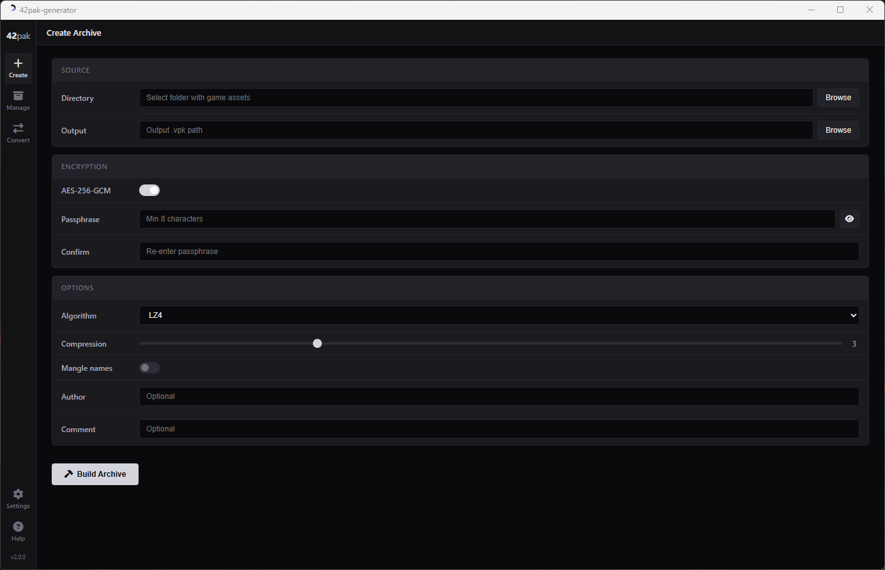

### Convert

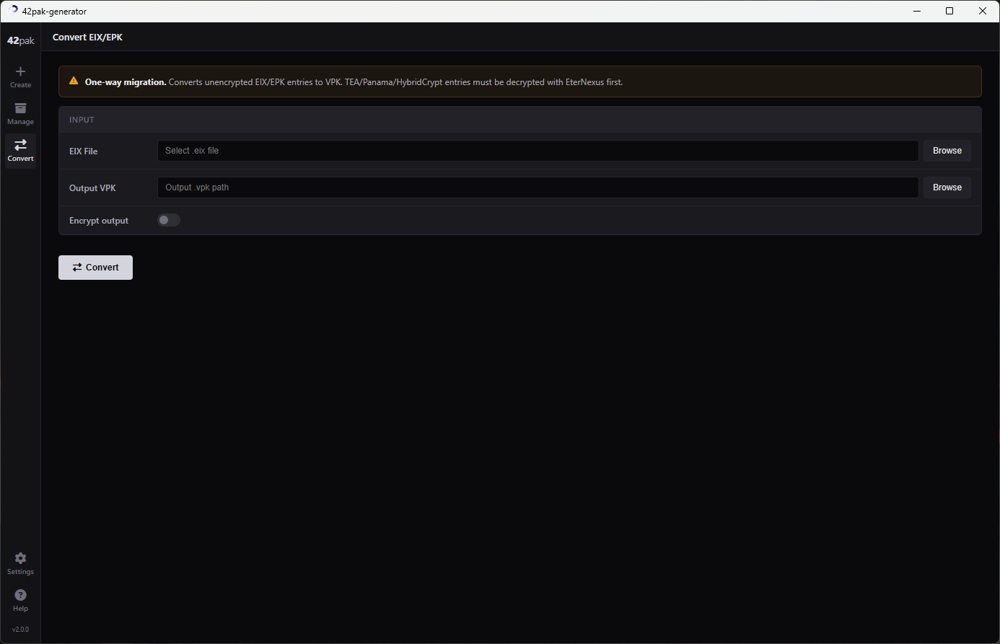

### Manage Archives

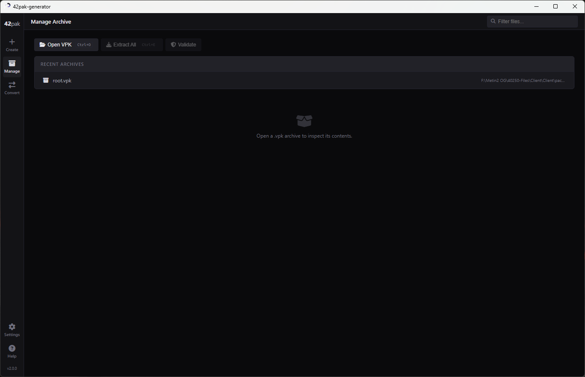

### Manage Archives (Detail)

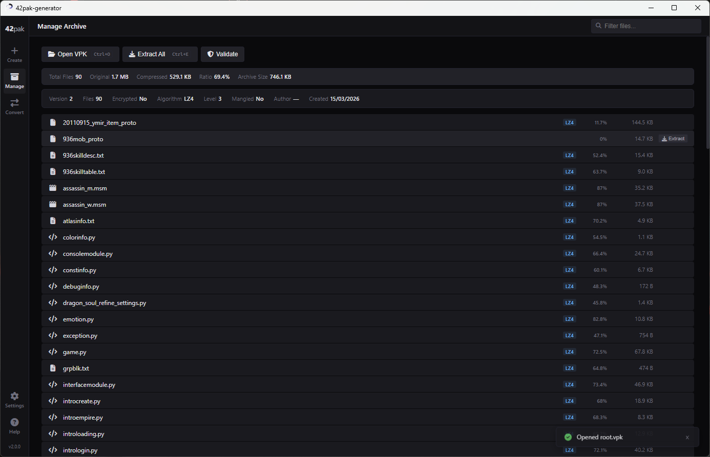

### Settings

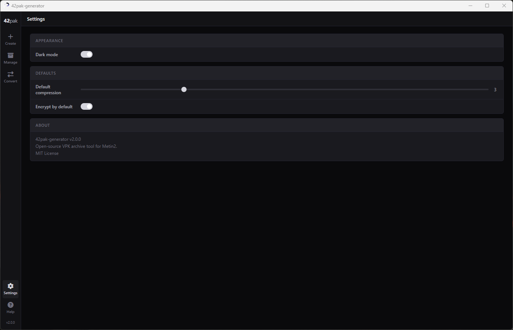

### Help

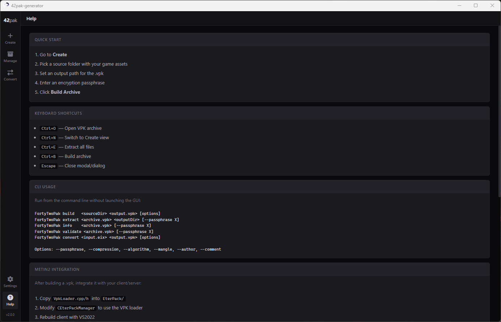

---

## Light Theme

### Home

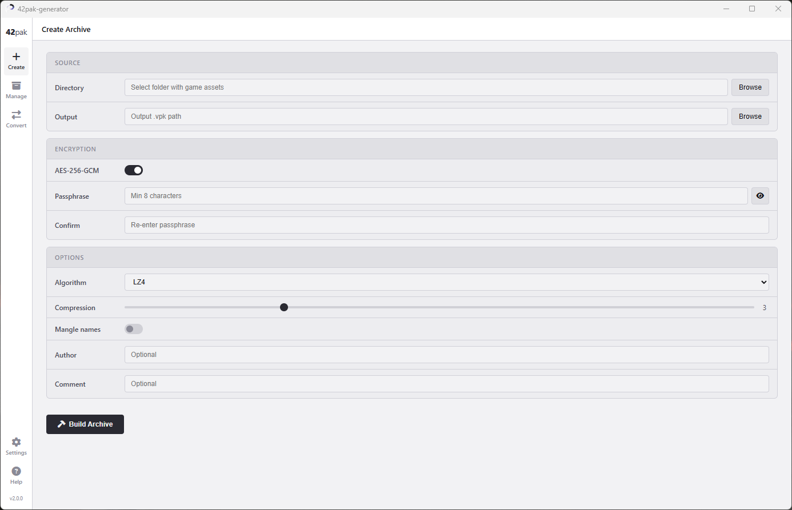

### Convert

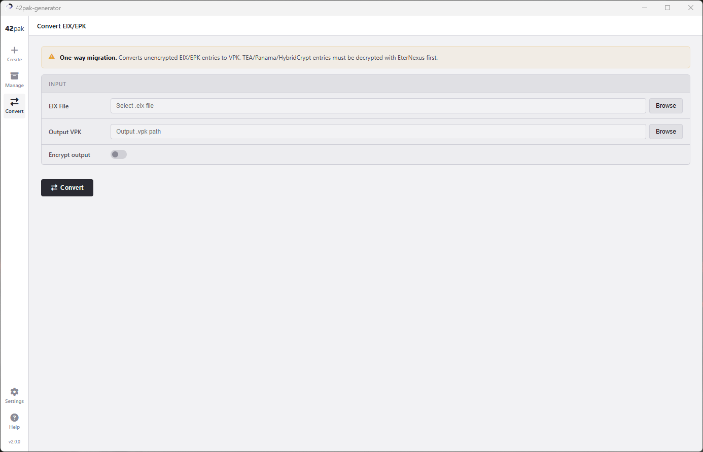

### Manage Archives

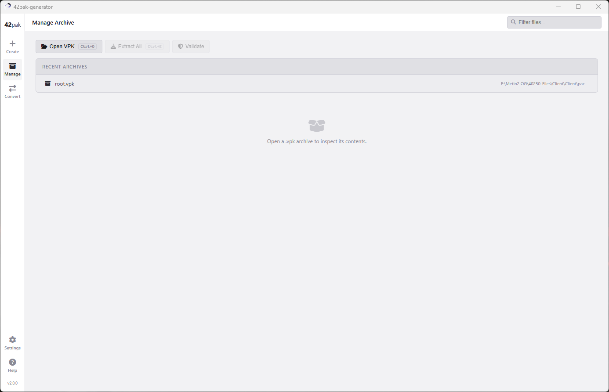

### Manage Archives (Detail)

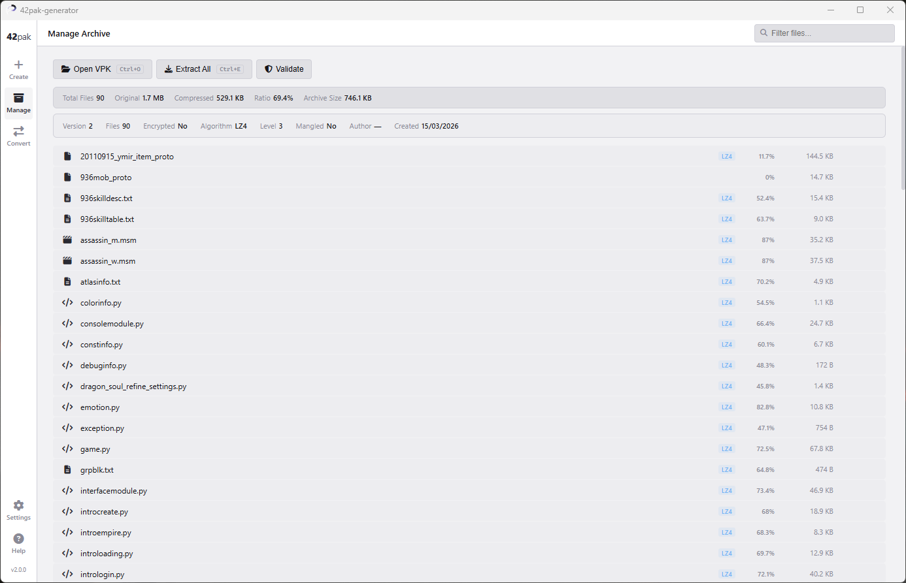

### Settings

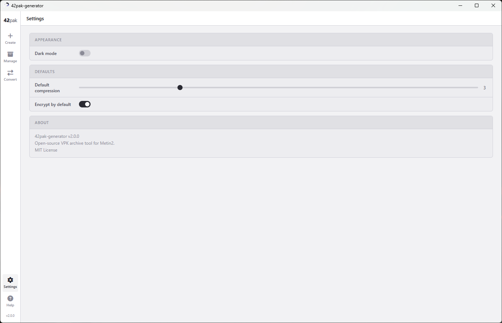

### Help

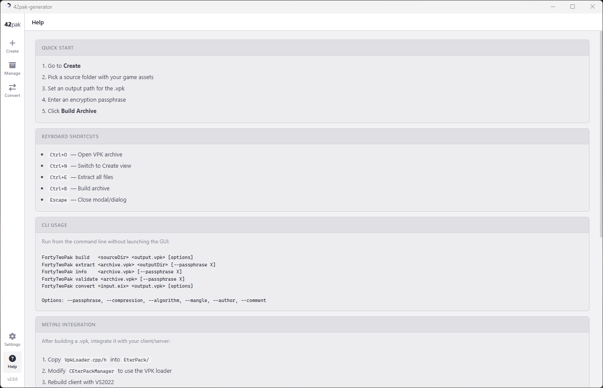
